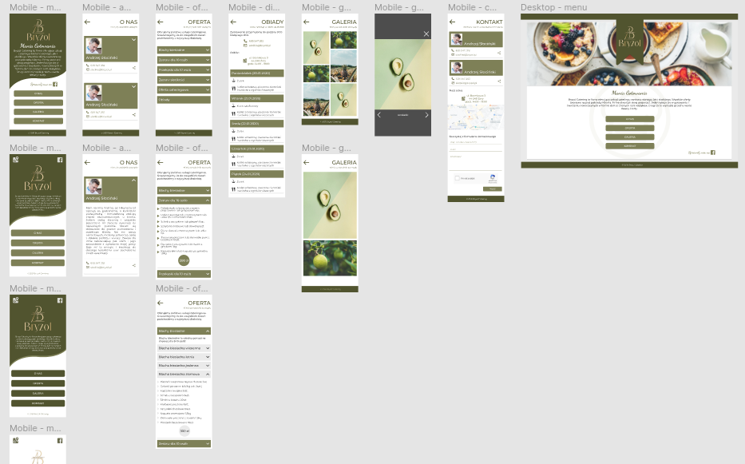

  

<h1 align="center">
  Bryzol Catering Webpage
</h1>

  Website based on Gatsby.js for Bryzol Catering, this is a second webiste built for this company.

## Table of contents
* [General info](#general-info)
* [Screenshots](#screenshots)
* [Technologies](#technologies)
* [Features](#features)
* [Status](#status)
* [Contact](#contact)

## General info
This project was created because I wanted to build real website, not from tutorial. This website is based on client needs. :rainbow:

## Screenshots

## Technologies
* Gatsby.js
* Styled-components
* GraphQL
* Figma

## Features
* Contact form with Firebase function -> [Bryzol Firebase](https://github.com/erq-programmer/bryzol-firebase)
* Offer page with clickable product list, like shopping list...

## Status
Project is: _in progress_

To-do list:
- [ ] Offer page

## Contact
Created by [@erykslocinski](mailto:eryk.slocinski@gmail.com) - feel free to contact me!

